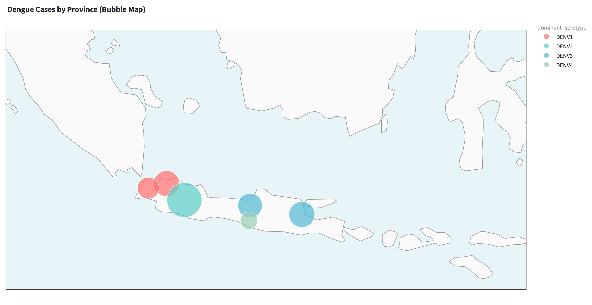
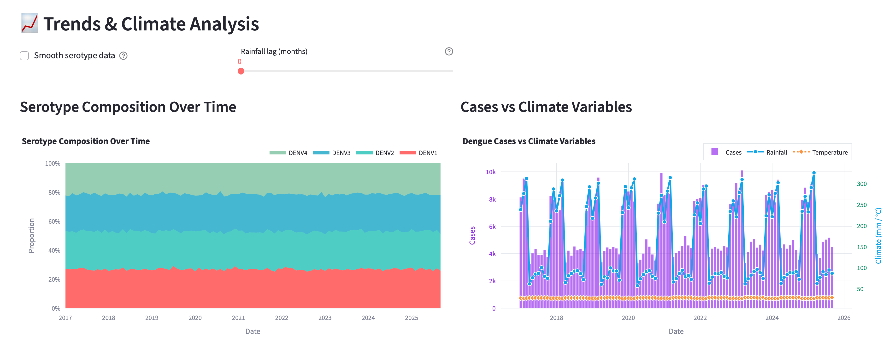
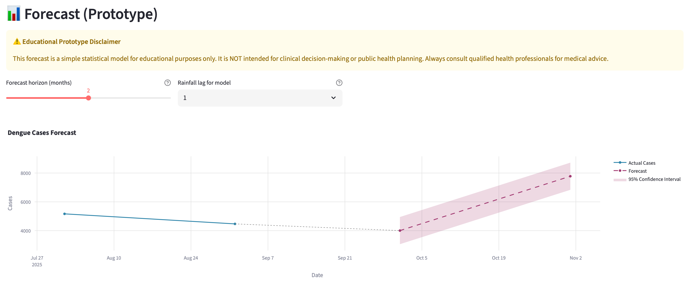

# GeneTropica 🦟

**Real-time dengue surveillance platform integrating viral genomics, climate data, and predictive modeling for Southeast Asia**

## 90-Second Overview

GeneTropica is an open-source dashboard that combines dengue serotype distribution, climate correlations, and forecasting models to support public health decision-making in Indonesia. Built with Streamlit for rapid deployment and easy customization.

### Key Features

- **🗺️ Interactive Serotype Mapping** - Real-time visualization of dominant dengue serotypes across provinces
- **🌡️ Climate Correlation Analysis** - Rainfall and temperature impacts with adjustable lag periods  
- **📈 Forecast Models** - 1-3 month predictions using seasonal patterns and climate variables
- **🧬 Phylogenetics Ready** - Infrastructure for genomic surveillance integration (coming soon)

### Screenshots


*Interactive bubble map showing dominant dengue serotypes by province*


*Serotype composition over time and climate correlation analysis*


*Predictive modeling with confidence intervals and performance metrics*

## Quick Start

### Installation (Local)

```bash
# Clone repository
git clone https://github.com/RyoungJKT/genetropica.git
cd genetropica

# Create conda environment
conda env create -f env.yaml
conda activate genetropica

# Generate mock data (first time only)
python -m src.data_io --make-mock

# Launch application
streamlit run app/app.py
```

The app opens at `http://localhost:8501`

### Deployment (Streamlit Community Cloud)

Deploy your own instance in 3 minutes:

1. **Fork this repository** to your GitHub account

2. **Go to** [share.streamlit.io](https://share.streamlit.io)

3. **Click "New app"** and connect your GitHub account

4. **Configure deployment:**
   - Repository: `your-username/genetropica`
   - Branch: `main`
   - Main file path: `app/app.py`

5. **Click "Deploy"** and wait ~2 minutes

Your app will be live at `https://your-app-name.streamlit.app`

#### Cloud Limitations

The Streamlit Cloud version runs with simplified features:
- ✅ All visualizations work (bubble map recommended)
- ✅ Mock data is pre-generated
- ⚠️ GeoPandas features degraded to basic functionality
- ⚠️ Maximum 1GB memory on free tier

For full functionality, use local installation with conda environment.

## Mock vs Real Data

### Currently Mock (Synthetic)
- **Dengue case counts** - Generated with seasonal patterns
- **Serotype distributions** - Simulated DENV1-4 proportions
- **Climate data** - Synthetic rainfall/temperature with monsoon patterns
- **Province boundaries** - Simplified rectangles for 6 provinces

### Roadmap to Real Data

| Data Source | Type | Timeline | Status |
|------------|------|----------|--------|
| **NCBI Virus** | Dengue sequences | Q1 2025 | 🔄 Planning |
| **CHIRPS** | Rainfall satellite data | Q1 2025 | 🔄 Planning |
| **ERA5** | Temperature reanalysis | Q1 2025 | 🔄 Planning |
| **Provincial Health Offices** | Case reports | Q2 2025 | 📝 Partnership needed |
| **GISAID** | Viral genomes | Q2 2025 | 📝 Access requested |
| **BMKG** | Local weather stations | Q2 2025 | 📝 API integration |

## Demo Script

### 5-Step Live Pitch Walkthrough

1. **Opening Impact (30 sec)**
   - Load app → Show map with current month
   - "6 provinces, 500+ monthly cases, 4 circulating serotypes"
   - Click through 2-3 months to show seasonal changes

2. **Climate Connection (30 sec)**
   - Scroll to climate chart
   - Adjust rainfall lag slider from 0→2 months
   - "Notice correlation increases at 2-month lag: -0.3 → -0.5"

3. **Predictive Power (30 sec)**
   - Navigate to forecast section
   - Show 2-month forecast with confidence bands
   - "MAE of ~150 cases, useful for resource planning"

4. **Data Download (15 sec)**
   - Click "Download Data" button
   - "Export filtered datasets for your own analysis"

5. **Future Vision (15 sec)**
   - Open Phylogenetics expander
   - "Genomic surveillance integration coming Q2 2025"
   - Mention real-time data pipeline plans

## Project Structure

```
genetropica/
├── app/
│   └── app.py              # Main Streamlit application
├── src/
│   ├── data_io.py          # Data loading and mock generation
│   ├── transforms.py       # Data preprocessing with caching
│   ├── charts.py           # Visualization components
│   └── forecast.py         # Predictive models
├── data/
│   └── mock/               # Synthetic datasets
├── docs/
│   └── methods.md          # Technical documentation
└── assets/                 # Images and resources
```

## Development

### Requirements
- Python 3.11+
- 4GB RAM minimum
- Modern browser (Chrome, Firefox, Safari)

### Performance
- First load: <3 seconds
- Cached operations: <500ms
- Monthly data updates: ~100KB

## Contributing

We welcome contributions! Priority areas:
- Real data integration pipelines
- Additional forecasting models
- Mobile-responsive optimizations
- Multi-language support (Bahasa Indonesia)

See [CONTRIBUTING.md](CONTRIBUTING.md) for guidelines.

## Ethical Considerations

- **No patient data**: All individual-level data is aggregated
- **Transparency**: Mock data clearly labeled
- **Validation**: Models benchmarked against published studies
- **Access**: Open source, free to use and modify

## Citation

If you use GeneTropica in your research:

```bibtex
@software{genetropica2024,
  title = {GeneTropica: Dengue Surveillance Platform},
  year = {2024},
  url = {https://github.com/RyoungJKT/genetropica}
}
```

## Contact

- **Technical Issues**: Open a GitHub issue
- **Partnerships**: genetropica@example.com
- **Data Sharing**: See docs/data_sharing.md

## License

MIT License - See [LICENSE](LICENSE) file

---

**Status**: 🟢 Active Development | **Version**: 0.1.0 MVP | **Last Updated**: December 2024